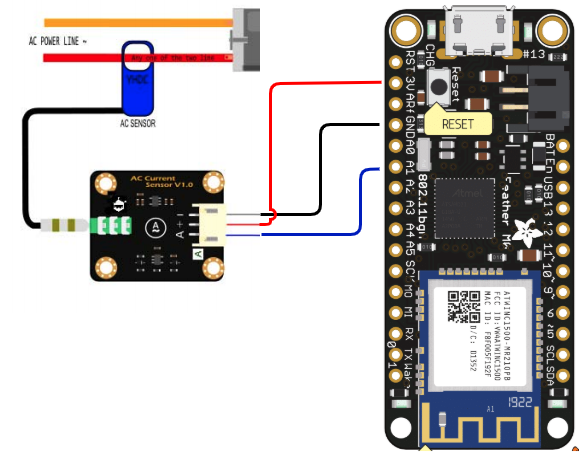

# Overview

I wanted to measure the Amps used of a old soda machines compressor.  After a few
false starts I found the [SEN0211](https://wiki.dfrobot.com/Gravity_Analog_AC_Current_Sensor__SKU_SEN0211_) by DfRobot.  I picked it up from [DigiKey](https://www.digikey.com/products/en?keywords=SEN0211) for $20.10

The key here is the AC Current Sensor board they pair with the [YMDC SCT013](http://en.yhdc.com/product/SCT013-401.html)  It smooths out the voltage coming from the sensor to something you can read on Arduino analog in.

## Mistakes 

My first mistake was to buy the first blue YMDC detector I could find on Amazon.  My second was to think that the 100 AMP version was better.   The code in this repo works with a detector that outputs Volts per Amps detected.  In my case it is 20A:1V.  The first detector I picked up was 100A:500ma.  The lesson I learned is though you will find YMDC detectors everywhere and in some cases they share model numbers.  You need to buy the correct one.

## Reference Voltage

Depending on your board the reference voltage will be differnt.  The [yhdc.cpp](yhdc.cpp) file is hard coded 3.3v (3300).   If you are using a 5V board change this value.

## Hardware

I have tested this on an [Adafruit Feather M0](https://learn.adafruit.com/adafruit-feather-m0-wifi-atwinc1500/pinouts)  However there is not much to this sensor and it should work with anything that can supply 3.3 or 5 volts and read one analog input.

### Wire Up

### Other Sensors

YHDC makes other sensors that output Volts per Amps.   If you are using a differnt sensor make sure to set `ACTectionRange` in yadc.h

## Thanks

Thanks to [Corey Singleton](https://github.com/CoreySingleton) for helping me navagate Digi-Key and finding the correct sensor. 
